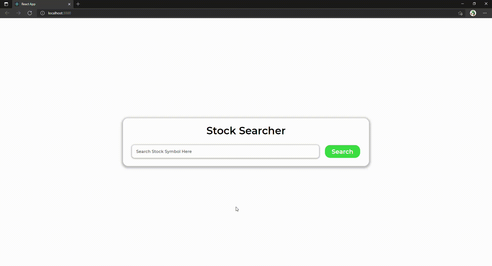
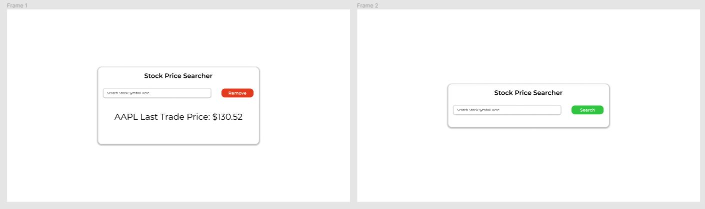

# Basic Stock Searcher

## Made with React and the Finnhub finnance API

This project allows use to enter stock symbols for example:  
"AAPL" : Apple  
"MSFT" : Microsoft  
"GOOG" : Alphabet Inc  
"BINANCE:BTCUSDT" : Bitcoin USD

and the last trade price will be returned

_**Note:** App will only work during open US Stock Market Hours Monday - Friday (9:30 a.m. to 4 p.m. Eastern time)_

## Technology/Features Used

React JS, Hooks, State, Sass(scss), NPM, REST API, Web Sockets

## Video Demo

## Figma UI Mockup

